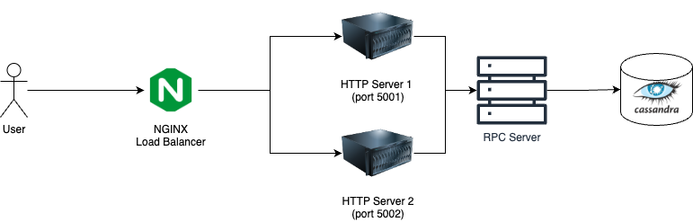

# assignment_demo_2023


## Architecture


## NGINX
- NGINX is an open-source web server and reverse proxy solution. 
- It is used as a load balancer to the 2 HTTP servers. 
- It uses a round-robin algorithm to determine which of the 2 servers to use.

## HTTP Server
- Using Hertz Golang HTTP Server

## Cassandra Database
- Cassandra is a NoSQL database that is used to store the data. 
- Scalable: A distributed database that is scalable by increasing the number of nodes.
- Cassandra fits the requirements of the project, especially for a chat application.
- Fault detection to reveal any damaged nodes in a cluster to prevent the risk of failure

### Cassandra Data Modelling

#### Definitions

- Primary Key: One or more partition keys, and optional clustering key
- Partition Key: A partition key is a column that determines the partition within a table where a row will be stored.
- Clustering Key: A clustering key is a column or set of columns that determines the order in which the rows will be stored within a partition.

#### Cassandra Clusters
- Clients can read/write to any node in the cluster.
- Contacted node acts as the coordinator for the request.
- Coordinator computes a hash of the partition key to determine which node(s) to contact.
- Coordinator sends the request to the closest owners
- Replication is asynchronous

#### Query Patterns

- To do data modelling in Cassandra Database, we first have to understand the 
query patterns that our application will have.
- **Query Pattern 1**: Get all messages from a chat room, sorted by timestamp, with a limit of 100 messages.
- **Query Pattern 2:** Get all chats of a particular user

#### Data Modelling
- **Primary Key**
  - **Partition Key**
    - Chat
  - **Clustering Key**
    - SendTime
- **Columns**
  - Text
  - Sender

## Installation

Requirement:

- golang 1.18+
- docker

To install dependency tools:

```bash
make pre
```

## Run

```bash
docker-compose up -d
```

Check if it's running:

```bash
curl localhost:8080/ping
```

## Areas of improvement
- Cassandra Database:
  - Using Cassandra database, we can easily scale horizontally by adding more nodes to the cluster. 
  - One way we can improve the Cassandra Database implementation is to increase the amount of nodes.
